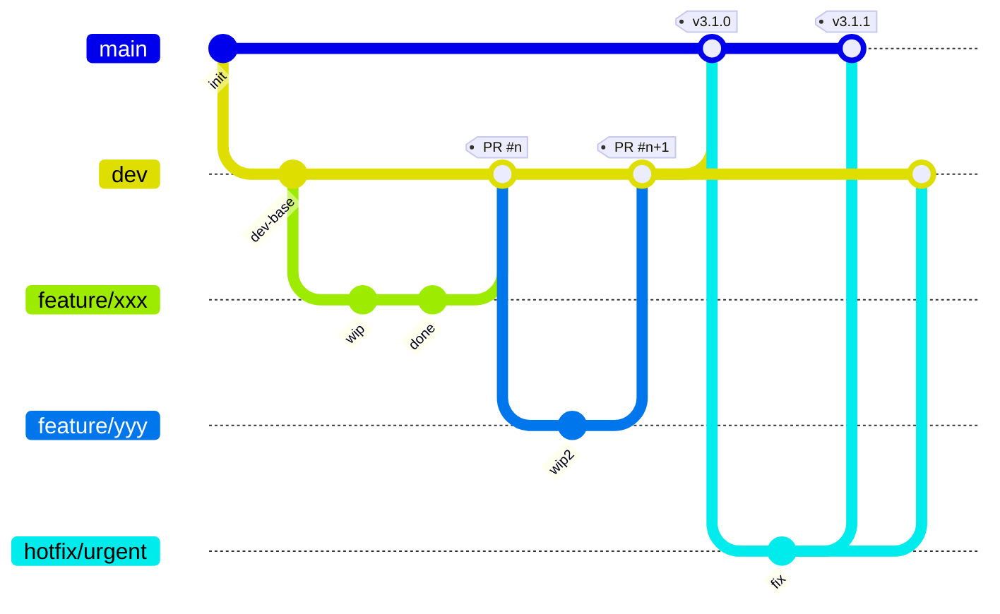

# RainCppAI 开发规范

> 适用于本项目的 C++ 编码风格指南，综合现有代码习惯 + Google C++ Style Guide + 项目特定约定。
> 所有贡献者请遵守此规范。**最后更新：2026-06-13**

---

## 1. 命名约定

### 1.1 类名 — `PascalCase`

```cpp
// ✅ 正确
class HttpServer { };
class AIStrategy { };
class ChatSendHandler { };
class DbConnectionPool { };

// ❌ 错误
class httpServer { };
class AI_Strategy { };
```

### 1.2 函数 / 方法名 — `camelCase`

```cpp
// ✅ 正确
void handleRequest();
void sendResponse();
std::string getSessionId();
bool isExpired();

// ❌ 错误
void HandleRequest();
void send_response();
```

### 1.3 成员变量 — `snake_case_`（尾部下划线）

```cpp
// ✅ 正确
class Session {
private:
    std::string session_id_;
    int max_age_;
    std::chrono::steady_clock::time_point created_at_;
};

// ❌ 错误
std::string sessionId_;    // camelCase_
int m_maxAge;              // m_ 前缀
int max_age;               // 无下划线（与局部变量混淆）
```

### 1.4 局部变量 / 函数参数 — `snake_case`（无下划线后缀）

```cpp
// ✅ 正确
void process(int user_id, const std::string& session_key) {
    auto now = std::chrono::steady_clock::now();
    int retry_count = 0;
}

// ❌ 错误
void process(int userId, const std::string& sessionKey) {
    auto now_ = std::chrono::steady_clock::now();
}
```

### 1.5 常量 / 枚举 — `kPascalCase` 或 `UPPER_CASE`

```cpp
// 枚举值 — kPascalCase（推荐）
enum class HttpMethod {
    kGet,
    kPost,
    kPut,
    kDelete
};

// 或 UPPER_CASE（SSL/TLS 等协议常量）
enum class SSLVersion {
    TLS_1_0,
    TLS_1_1,
    TLS_1_2,
    TLS_1_3
};

// 编译期常量 — UPPER_CASE
constexpr int MAX_SESSIONS = 500;
constexpr size_t BUFFER_SIZE = 4096;
```

### 1.6 命名空间 — `小写单词`

命名空间命名遵循**简洁描述性**原则，不使用品牌式前缀。
各模块的具体命名空间定义见对应 `TECHDOC.md`。

```cpp
// 示例：顶层命名空间（与模块对应）
namespace http { }
namespace ai { }
namespace chat { }

// 示例：子命名空间（http 下）
namespace http::session { }
namespace http::router { }
namespace http::middleware { }
namespace http::ssl { }
```

**规则**：
- 禁止使用品牌式 / 伞式前缀（如 `rain::`）
- 禁止在头文件中 `using namespace` 指令
- `.cpp` 中允许 `using namespace`（仅在需要时）

### 1.7 文件名

| 类型 | 约定 | 示例 |
|------|------|------|
| 头文件 | `PascalCase.h` | `HttpServer.h`、`AIStrategy.h` |
| 源文件 | `PascalCase.cpp` | `HttpServer.cpp`、`AIStrategy.cpp` |
| 目录 | `lowercase` 或 `camelCase` | `router/`、`middleware/` |

---

## 1.7 目录命名

模块顶层目录、模块内子目录均使用 **PascalCase**。已存在的 lowercase 子目录逐步对齐，新增目录强制执行 PascalCase。

```text
// ✅ 正确（新增目录）
Common/Config/    Common/Threading/    Common/Http/
Infralib/Mq/      Infralib/Logging/
Tests/
Docs/Archive/
```

**例外**：第三方库目录（`.venv/`、`.node_modules/`）、Git 目录（`.git/`）、构建产物目录（`build/`）不受此规则约束，保持原名。

---

## 2. 头文件规范

### 2.1 Include Guard — `#pragma once`

```cpp
// ✅ 推荐（所有现代编译器支持）
#pragma once

// ❌ 不推荐（易写错）
#ifndef HTTP_SERVER_H
#define HTTP_SERVER_H
// ...
#endif
```

### 2.2 Include 路径 & 顺序

#### 路径规则

项目头文件**不包含 `include/` 目录名**，路径起点为各模块的 `include/` 根目录。
CMake 须配置对应的 `include_directories`。

```cpp
// ✅ 跨模块用路径
#include "http/HttpRequest.h"         // → HttpServer/include/http/HttpRequest.h
#include "llm/AIHelper.h"             // → AIEngine/include/llm/AIHelper.h
#include "server/ChatServer.h"        // → AIServerCore/include/server/ChatServer.h

// ✅ 同模块内也用路径（不依赖当前文件位置）
#include "router/Router.h"

// ❌ 禁止裸文件名
#include "AIHelper.h"

// ❌ 禁止冗长完整路径
#include "HttpServer/include/http/HttpServer.h"

// ❌ 禁止相对路径回溯
#include "../../../include/middleware/cors/CorsMiddleware.h"
```

#### 顺序（Google 风格 + 组内字母序）

五组顺序不变，**每组内部按字母序排列**（大写优先于小写，`_` 在字母之前）。

```cpp
// 1. 对应的头文件 (foo.cpp → foo.h)
#include "Foo.h"

// 2. C 系统头文件（字母序）
#include <sys/types.h>
#include <unistd.h>

// 3. C++ 标准库头文件（字母序）
#include <memory>
#include <string>
#include <vector>

// 4. 其他第三方库头文件（字母序）
#include <muduo/net/TcpServer.h>
#include <nlohmann/json.hpp>

// 5. 本项目头文件（字母序）
#include "http/HttpRequest.h"
#include "llm/AIHelper.h"
#include "router/Router.h"
#include "utils/ThreadPool.h"
```

### 2.3 前向声明优先

```cpp
// ✅ 头文件中尽量用前向声明代替 #include
class TcpConnection;
namespace muduo { namespace net { class EventLoop; } }

// 在 .cpp 中再 #include 完整定义
```

### 2.4 内联函数

- ≤ 10 行的简单函数可内联在头文件中
- 构造函数 / 析构函数一般不内联（除非为空）

---

## 3. 作用域与智能指针

### 3.1 优先使用 `std::shared_ptr` / `std::unique_ptr`

```cpp
// ✅ 正确
std::shared_ptr<AIHelper> getHelper(const std::string& session_id);
std::unique_ptr<HttpResponse> createResponse();

// ❌ 禁止裸 new / delete
AIHelper* helper = new AIHelper();  // 禁止
```

### 3.2 `enable_shared_from_this` 模式

```cpp
class Session : public std::enable_shared_from_this<Session> {
    // 允许在成员函数中返回自身的 shared_ptr
};
```

---

## 4. 并发规范

### 4.1 锁选择

| 场景 | 锁类型 |
|------|--------|
| 读多写少 | `std::shared_mutex` + `shared_lock` / `unique_lock` |
| 读写均衡 / 写多 | `std::mutex` + `lock_guard` |
| 简单标志位 | `std::atomic<bool>` / `std::atomic<int>` |

### 4.2 锁粒度

```cpp
// ✅ 正确：最小锁范围
{
    std::shared_lock lock(mutex_);
    auto it = map_.find(key);
}  // 锁在此释放

// 后续操作不加锁
process(it->second);

// ❌ 错误：锁范围过大
std::lock_guard lock(mutex_);
auto it = map_.find(key);
process(it->second);  // 长时间操作在锁内执行
```

### 4.3 线程池

```cpp
// 使用 ThreadPool 处理耗时任务，IO 线程不阻塞
auto future = thread_pool_.enqueue([this, session_id]() {
    return ai_helper_->chat(session_id, message);
});
// 通过 runInLoop 回调回 IO 线程
```

---

## 5. 错误处理

### 5.1 数据库 / 网络错误

```cpp
// ✅ 使用 try-catch + 日志
try {
    auto conn = pool_->getConnection();
    conn->execute(sql);
} catch (const std::exception& e) {
    LOG_ERROR("DB error: {}", e.what());
    return HttpResponse::internalServerError();
}
```

### 5.2 超时处理

```cpp
// 等待可配置超时，防止永久阻塞
if (!cv_.wait_for(lock, std::chrono::seconds(3), [this] { return !pool_.empty(); })) {
    throw std::runtime_error("DB connection pool timeout");
}
```

---

## 6. 注释规范

### 6.1 文件头注释（Doxygen 风格）

```cpp
/**
 * @file HttpServer.h
 * @brief HTTP 服务器核心头文件
 *
 * 基于 muduo 网络库的高性能 HTTP 服务器实现。
 * 采用事件驱动架构，支持多线程并发处理。
 */
```

### 6.2 函数注释

```cpp
/**
 * @brief 处理 HTTP 请求
 * @param req HTTP 请求对象
 * @param conn TCP 连接指针
 * @return HTTP 响应对象
 */
HttpResponse handleRequest(const HttpRequest& req, const TcpConnectionPtr& conn);
```

### 6.3 成员变量注释

```cpp
int max_sessions_;       ///< 最大会话数（默认 500）
bool is_running_;        ///< 服务器运行状态
```

---

## 7. 代码格式化

- **缩进**：4 空格（不使用 Tab）
- **行宽**：最大 120 字符
- **大括号**：Allman 风格（左括号换行）
- **指针 / 引用**：`Type* ptr`、`Type& ref`（`*` 和 `&` 紧贴类型）

**.clang-format**：项目根目录包含 `.clang-format` 配置文件。每次编辑 `.cpp` / `.h` 文件后，必须运行 `clang-format -i <文件路径>` 确保格式一致。CMakeLists.txt 已配置 `make format` 目标，每次 commit 前必须执行：
```cmake
file(GLOB_RECURSE ALL_SOURCE_FILES *.cpp *.h)
add_custom_target(format COMMAND clang-format -i ${ALL_SOURCE_FILES})
```
编辑后执行 `make format` 格式化所有源文件，commit 前确保格式正确。

```cpp
// ✅ 正确
if (condition) {
    doSomething();
} else {
    doOther();
}

void foo(int* ptr, const std::string& str) {
    // ...
}
```

---

## 8. CMake 规范

```cmake
# 最低版本
cmake_minimum_required(VERSION 3.16)

# C++ 标准
set(CMAKE_CXX_STANDARD 17)
set(CMAKE_CXX_STANDARD_REQUIRED ON)

# 编译选项
set(CMAKE_CXX_FLAGS "${CMAKE_CXX_FLAGS} -Wall -Wextra -O2")

# 源文件按模块分组
add_executable(http_server
    HttpServer/src/http/HttpServer.cpp
    AIServerCore/src/server/ChatServer.cpp
    # ...
)
```

---

## 9. 设计原则

1. **RAII 优先** — 资源由对象生命周期管理，禁止裸 `new`/`delete`
2. **接口与实现分离** — 头文件只暴露必要的 public API
3. **组合优于继承** — 优先使用组合模式（如 Strategy 模式）
4. **单一职责** — 每个类只做一件事；函数不超过 50 行
5. **显式优于隐式** — 用 `enum class` 而非 `int`；用命名常量而非魔数

---

## 10. Git 分支策略与协作流程

> 所有贡献者必须遵守此 Git 工作流。**最后更新：2026-08-07**

### 10.1 分支模型



| 分支 | 用途 | 保护 | 说明 |
|------|------|------|------|
| `main` | 生产就绪代码 | 🔒 锁定 — 禁止直接 push，必须通过 PR 合并 | 每次合并即发版，须打 tag |
| `dev` | 开发集成分支 | 🛡️ 默认分支 — 所有 PR 的目标分支 | 日常开发的最新代码汇集地 |
| `feature/xxx` | 功能开发 | 无 | 从 `dev` 切出，完成后 PR 回 `dev` |
| `hotfix/xxx` | 紧急修复 | 无 | 从 `main` 切出，修复后 PR 回 `main` + 同步回 `dev` |
| `release/x.y.z` | 发版准备 | 无（可选） | 从 `dev` 切出，仅允许 bugfix，最终合并到 `main` 并打 tag，再同步回 `dev` |

### 10.2 GitHub 仓库设置（由仓库管理员配置）

**默认分支**：`dev`（Settings → Default branch → 切换为 `dev`）

**`main` 分支保护规则**（Settings → Branches → Add branch protection rule）：
- **Branch name pattern**：`main`
- ✅ **Require a pull request before merging** — 禁止直接 push，必须走 PR
- ✅ **Require status checks to pass before merging** — CI/CD 必须通过

### 10.3 日常工作流

#### 10.3.1 开始新功能

```bash
# 1. 切换到 dev 并拉取最新
git checkout dev
git pull origin dev

# 2. 创建 feature 分支（命名：feature/<简短描述>）
git checkout -b feature/vision-thumbnail-cache

# 3. 开发、提交
git add -A
git commit -m "feat(vision): add thumbnail cache with LRU eviction"

# 4. 推送并创建 PR
git push origin feature/vision-thumbnail-cache
# → 在 GitHub 创建 PR，目标分支自动为 dev（因为 dev 是默认分支）
```

#### 10.3.2 Commit 信息规范

遵循 [Conventional Commits](https://www.conventionalcommits.org/)：

```
<type>(<scope>): <简短描述>

[可选的详细描述]
[可选的 footer（如 Closes #123）]
```

| type | 说明 |
|------|------|
| `feat` | 新功能 |
| `fix` | Bug 修复 |
| `docs` | 文档变更 |
| `style` | 代码格式（不影响功能） |
| `refactor` | 重构（非功能/非修复） |
| `perf` | 性能优化 |
| `test` | 添加/修改测试 |
| `chore` | 构建、CI、依赖等杂项 |
| `revert` | 回滚 |

**示例**：
```text
feat(vision): add ONNX MobileNetV2 inference pipeline
fix(session): prevent empty session list after page refresh
docs(readme): sync bilingual README with v3.0.0 changes
chore(ci): add clang-format check to GitHub Actions
```

#### 10.3.3 PR 要求

- PR 标题使用 Conventional Commits 格式
- 描述中说明变更内容、测试方法
- 至少一人 Review 通过后方可合并
- CI/CD 流水线必须全部通过
- 合并优先使用 **Squash and Merge**（保持 `dev` 提交历史整洁）

#### 10.3.4 紧急修复（Hotfix）

```bash
# 1. 从 main 切出 hotfix 分支
git checkout main
git pull origin main
git checkout -b hotfix/crash-on-empty-db

# 2. 修复、提交
git commit -m "fix(server): prevent crash when DB connection pool is empty"

# 3. PR 到 main（注意：目标分支手动选择 main）
git push origin hotfix/crash-on-empty-db
# → 创建 PR 时，目标分支选择 main

# 4. 合并后，同步回 dev
git checkout dev
git merge main  # 或 cherry-pick 修复 commit
git push origin dev
```

### 10.4 发版流程

```bash
# 1. 确保 dev 测试通过
git checkout dev
make format && cmake --build build && cd build && ctest

# 2. 合并到 main
git checkout main
git merge dev --no-ff  # 保留合并历史

# 3. 打标签
git tag -a v3.1.0 -m "Dr.Rain v3.1.0 — <发版说明>"

# 4. 推送
git push origin main --tags

# 5. (可选) 同步回 dev
git checkout dev
git merge main
git push origin dev
```

> ⚠️ **重要**：生产环境始终部署 `main` 分支的最新 tag 版本。`dev` 分支仅用于开发和集成测试，不得部署到生产环境。
