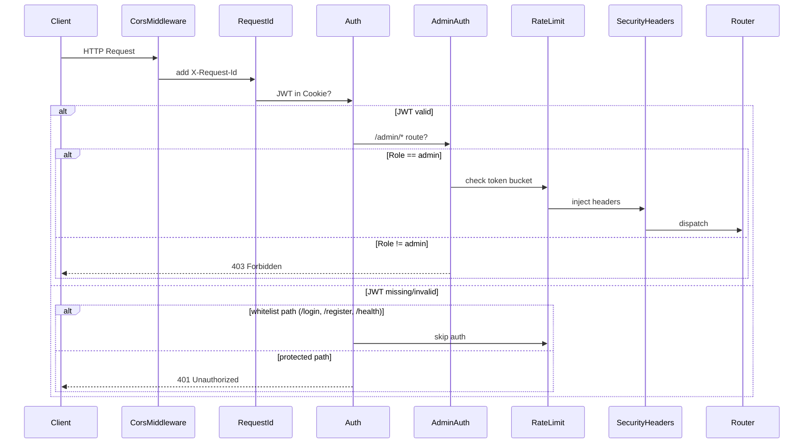

# 架构设计

## 整体架构图

```
Browser / Nginx
  └─► muduo EventLoop (Reactor pattern)
        └─► CorsMiddleware → RequestId → Auth → AdminAuth → RateLimit → SecurityHeaders
              └─► Router::dispatch()
                    ├─► StaticFileHandler    ← CSS / JS / images
                    ├─► ChatSseHandler        ← SSE streaming (only dialog entry)
                    ├─► ChatHistoryHandler    ← Session history from MySQL
                    ├─► ChatSessionsHandler   ← Session list
                    ├─► Admin*Handler (×8)    ← Dashboard / users / invites / logs
                    ├─► ChangePasswordHandler ← Password change
                    ├─► HealthHandler         ← GET /health
                    ├─► MetricsHandler        ← GET /metrics
                    └─► McpHandler            ← MCP JSON-RPC 2.0
                          ↓
                    AIEngine::AIHelper
                      ├─► AIModelStrategy    ← Qwen / DouBao
                      ├─► AIToolRegistry     ← MCP tools
                      ├─► McpClientManager   ← stdio/sse client
                      ├─► ImageRecognizer    ← ONNX Runtime
                      └─► AISpeechProcessor  ← TTS
                          ↓
                    Storage::MysqlUtil → MySQL (8 tables + FK)
```

## 四大模块

| 模块 | 路径 | 职责 | 依赖 |
|------|------|------|------|
| **HttpServer** | `HttpServer/` | 纯网络库 — HTTP 解析、路由、中间件、会话管理、SSL | muduo, OpenSSL, spdlog |
| **AIEngine** | `AIEngine/` | AI 工具库 — LLM 调用、MCP 协议、视觉识别、TTS | libcurl, ONNX, OpenCV, Storage |
| **AIServerCore** | `AIServerCore/` | 业务编排层 — 30+ Handler、Repository/Service 分层 | HttpServer + AIEngine |
| **Storage** | `Storage/` | 数据访问层 — MySQL 连接池、PreparedStatement | MySQL Connector C++ |

### 依赖方向（单向）

```
AIServerCore → HttpServer
AIServerCore → AIEngine → Storage
HttpServer → (无业务依赖)
AIEngine → (无 HttpServer 依赖)
```

## C++ 后端鉴权路由逻辑

### 中间件链（按序执行）

```
HTTP Request
  ↓
1. CorsMiddleware     — CORS 预检 / 跨域头注入
2. RequestIdMiddleware — 注入 X-Request-Id
3. AuthMiddleware      — JWT Token 校验（白名单路径跳过）
4. AdminAuthMiddleware — Admin 角色校验（仅 /admin/* 路径）
5. RateLimitMiddleware  — Token Bucket 限流（按 IP + 端点）
6. SecurityHeaders      — CSP / HSTS / X-Frame-Options 安全头
  ↓
Router::dispatch()
  ↓
Handler::handle()
```

### 鉴权流程



### JWT 实现细节

- **存储位置**：HttpOnly Cookie（`raincpp_token`）+ localStorage fallback
- **过期策略**：Access Token 24h，无 Refresh Token（v3.0）
- **密钥来源**：`config.json` → `jwt.secret`，启动时若为空则 `<random>` 生成 64 位 hex
- **实现文件**：`Common/Auth/JwtService.h` / `.cpp`，使用 HMAC-SHA256

### 安全播种（Root 账号自动创建）

启动时检测 `users` 表是否存在 `root` 用户：
- 若不存在：使用 `std::random_device` 生成 12 位强密码 → argon2id 哈希 → 插入 `users` 表
- 密码通过 `spdlog::critical` 带边框输出到控制台（仅首次），不写入任何日志文件
- Lockout 策略：单 IP 5 次失败锁定 15 分钟（`config.json` → `security.login_lockout_*`）
